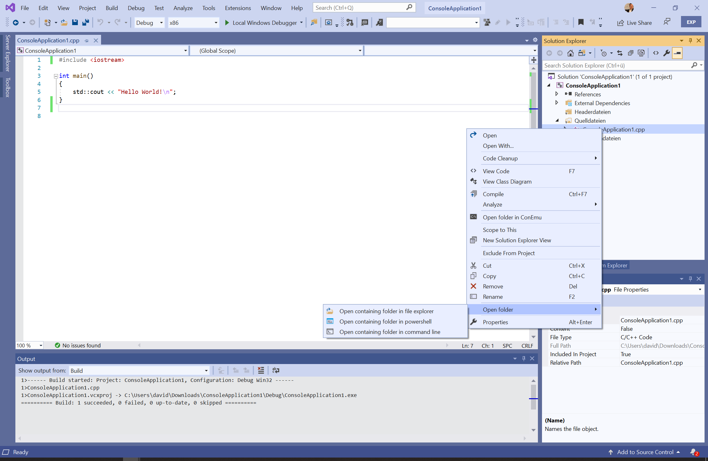

# OpenFolderExtension

<!-- Replace this badge with your own-->

<!-- Update the VS Gallery link after you upload the VSIX-->
Download this extension from the [VS Gallery](https://visualstudiogallery.msdn.microsoft.com/[GuidFromGallery])
or get the [CI build](http://vsixgallery.com/extension/9a6a346e-9753-4703-8208-425eb1181d4d/).

---------------------------------------

Open containing folder feature for all items within the solution explorer.
 
See the [changelog](CHANGELOG.md) for changes and roadmap.

## Features

- Open the containing folder of a file in the Solution Explorer

### Open the containing folder of a file in the Solution Explorer
Select a file or a project in the Solution Explorer and right-click it.

And the select the "Open folder" to open the explorer.

## Contribute
Check out the [contribution guidelines](CONTRIBUTING.md)
if you want to contribute to this project.

For cloning and building this project yourself, make sure
to install the
[Extensibility Tools 2015](https://visualstudiogallery.msdn.microsoft.com/ab39a092-1343-46e2-b0f1-6a3f91155aa6)
extension for Visual Studio which enables some features
used by this project.

## License
[Apache 2.0](LICENSE)